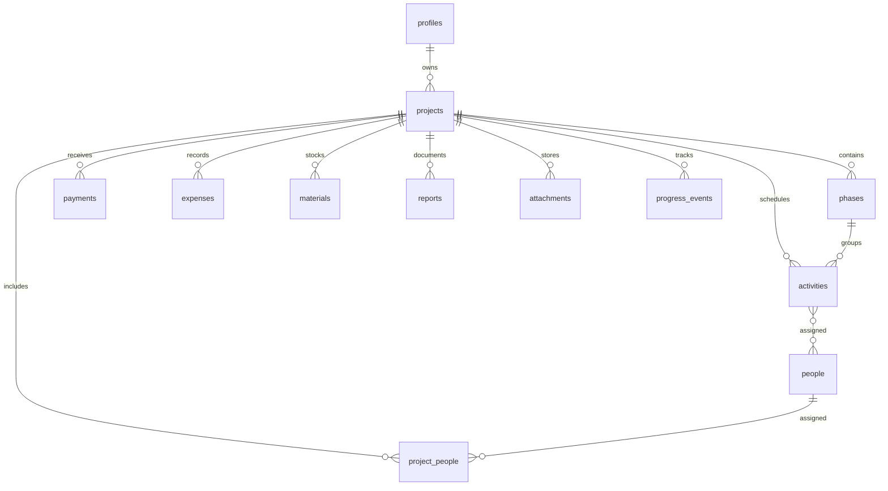

# Alliya Kalenda V1

## Direction

Alliya Kalenda is a local-first Flutter application for engineers, site supervisors and project managers. Android and desktop share the same domain and application layers. The local store is the source of truth for the UI; synchronization pushes pending changes to Supabase when connectivity returns.

## Layers

- `lib/core`: app theme, routing, formatting and shared primitives.
- `lib/domain`: entities, enums and repository contracts. This layer has no Flutter or Supabase dependency.
- `lib/data`: local persistence, sync queue and Supabase adapters.
- `lib/features`: screens and presentation state grouped by navigation area.

The first vertical slice ships with a local demo store so the dashboard is usable without credentials. Supabase is an adapter, not a requirement for opening the application.

## Data model

The authenticated user owns a workspace profile and the records below. Foreign keys use `on delete cascade` for project-owned records and `on delete set null` where historical records may outlive a project.

### Tables

- `profiles`: owner settings, company, phone, currency, date format, notification and theme preferences.
- `projects`: project identity, client, dates, financial amounts, status and manual progress.
- `people`: reusable directory of workers and collaborators.
- `project_people`: many-to-many assignment between projects and people.
- `phases`: project phases with their own progress.
- `activities`: agenda items, optional phase, status, priority, dates and notes.
- `activity_people`: many-to-many assignment between activities and people.
- `payments`: received payments and supporting attachment.
- `expenses`: project expenses and supporting attachment.
- `materials`: inventory purchased, used and remaining.
- `reports`: daily site reports and future validation/signature fields.
- `attachments`: photos, documents and receipts stored in Supabase Storage after sync.
- `progress_events`: append-only history of progress changes.
- `sync_queue`: local-only operational queue; the server may later expose a sync audit table.

All server tables include `id`, `owner_id`, `created_at`, `updated_at` and are protected by RLS using `owner_id = auth.uid()`. The V1 does not implement roles or permissions.

## Main screens

- **Dashboard**: project totals, progress, today's activities, deadlines, recent payments, expenses and sync status.
- **Agenda**: day/week/month switcher, activity list, filters and create/edit activity flow.
- **Projets**: searchable project list, status filters and project detail tabs: overview, progression, phases, finances, materials, media and reports.
- **Personnes**: directory with create/edit/delete and project assignments.
- **Finances**: payment and expense streams with project/date/category filters and totals.
- **Rapports**: daily report list and editor, with PDF export reserved for a later increment.
- **Parametres**: profile, currency, date format, notification, backup/sync and theme settings.

## Sync rules

1. Every mutation is written locally with `updated_at` and an operation in `sync_queue`.
2. A connectivity listener triggers sync; manual retry is always available.
3. Pull remote changes by `updated_at`, then push local operations in order.
4. V1 uses last-write-wins for scalar fields and keeps attachment uploads idempotent by content hash.
5. Deletions are tombstones until the operation is acknowledged by the server.
6. The UI exposes `Synchronise`, `Synchronisation...` and `Hors ligne` states.
